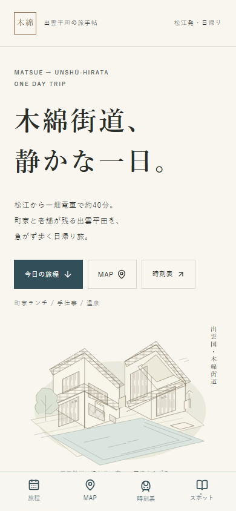

# 木綿街道、静かな一日。

松江から一畑電車で出雲平田へ。iPhoneで開いたまま、電車、町家ランチ、老舗、手仕事、神社、温泉、帰りの電車まで使える日帰り旅手帖です。

- **公開サイト**：[anemia111.github.io/momen-kaido-guide](https://anemia111.github.io/momen-kaido-guide/)
- **リポジトリ**：[anemia111/momen-kaido-guide](https://github.com/anemia111/momen-kaido-guide)
- **情報確認日**：2026年10月4日
- **調査と採用判断**：[docs/research-notes.md](docs/research-notes.md)
- **外部リンク全件・接続検査**：[docs/external-links.md](docs/external-links.md)
- **検証記録**：[docs/verification.md](docs/verification.md)

## 実装

React 19、TypeScript 6 strict、Vite 8、Tailwind CSS 4、Leaflet 1.9／React Leaflet 5、Lucide、ESLint、Prettier、Playwright、axe-core。バックエンド・DB・APIキーは不要です。GitHub Actionsで検証してからGitHub Pagesに公開します。

平日／土日祝切替の旅程、タイムラインから直接開けるMAP・公式SNS・予約・電話、第一候補814と代替の食事候補3店、独立した醤油店3店と紙の店舗2施設、出発前チェック、公式運行情報・出発駅／帰り駅の時刻表、店舗の出典と確認日、予算、建築の見どころを掲載しています。公式確認できないSNSは表示しません。

モバイルの固定ナビは4項目。`viewport-fit=cover`と`safe-area-inset-bottom`を適用し、操作領域は44px以上。フォーカス表示、本文スキップ、文字つきリンク、動きを減らす設定に対応。Leafletの背景地図は「町歩きMAPを開く」を押した時だけ読み込みます。地図が読めない時も各施設の地図アプリと公式PDFへ進めます。

共有はWeb Share API、非対応ならクリップボード、権限拒否時は選択できるURLを表示します。Manifest、Apple Touch Icon、favicon、theme-color、SEO／OGPを同梱。Safariの「ホーム画面に追加」で利用できます。オフライン対応のサービスワーカーは入れていません。交通・営業情報、地図、予約などの利用には通信が必要です。

## 開発

Node.js 24を使用します。

```sh
npm ci
npm run dev
```

表示URLは `http://localhost:5173/momen-kaido-guide/`。公開と同じサブパスで確認します。

```sh
npm run lint
npm run format:check
npm run build
npx playwright install chromium webkit
npm test
```

`npm run format`で整形、`npm run preview -- --port 4174`でビルド済みファイルを確認できます。

## 主な構成と情報更新

| ファイル                       | 更新する情報                                              |
| ------------------------------ | --------------------------------------------------------- |
| `src/data/links.ts`            | 公式URL、SNS、予約URL、電話、共通出典、確認日、公開URL    |
| `src/data/spots.ts`            | 住所、営業、休み、料金、説明、座標、出典                  |
| `src/data/restaurants.ts`      | 飲食候補、予算、予約可否、徒歩目安                        |
| `src/data/transport.ts`        | 電車時刻、列車番号、運賃、改正日、公式ダイヤURL           |
| `src/data/schedule.ts`         | 徒歩・滞在時間とモデルコース。列車時刻はtransportから参照 |
| `src/data/costs.ts`            | 費用内訳と合計。価格改定時に両方を再計算                  |
| `src/data/editorial.ts`        | 建築、旅の紹介、曜日の注意、期限付き臨時休館情報          |
| `src/data/types.ts`            | 施設・リンク・旅程の型                                    |
| `src/App.tsx` / `src/App.css`  | 画面・共有・絞り込み・モバイル表示                        |
| `src/components/GuideMap.tsx`  | 地図、マーカー、地図アプリへの導線、地図障害の案内        |
| `public/`                      | オリジナル線画・アイコン、Manifest、共有画像              |
| `tests/journey.spec.ts`        | 旅行中の動線と端末幅の検証                                |
| `.github/workflows/deploy.yml` | 自動検証とPages公開                                       |

### 観光情報・リンクを変える

1. 店舗公式／公式からリンクされたSNS／運営施設／鉄道公式を再確認。推定のSNS、予約URLを追加しない。
2. `src/data/`の該当データを変更し、`links.ts`の確認日と`docs/research-notes.md`の採用根拠を更新。営業時間を確認できなければ「要確認」を残す。
3. 運賃や温泉料金が変わったら `costs.ts` の合計も計算し直す。ダイヤ変更なら `transport.ts` と滞在時間の整合を確認する。
4. `lint`、`format:check`、`build`、`test`を実行してからmainへpush。

臨時休館は `editorial.ts` の `closureNotices` に終了日（JSTのYYYY-MM-DD）を設定。期限後は自動で表示から外れます。祝日は自動判定していないので画面で土日祝を選びます。

リンク検査を再実行する場合、プレビューを4174で起動して、別のターミナルで以下を実行します。

```sh
node scripts/audit-links.mjs
npm run format
```

`AUDIT_URL`環境変数で公開サイトなどを指定できます。リンク一覧・JSON・代表画面をdocsに保存します。HTTP成功と営業中は別なので、情報内容も確認してください。SNSの認証・配信制限がある場合は公式サイトからの本人性確認と当日利用の導線を維持します。

## 公開方法

GitHubの **Settings → Pages → Source: GitHub Actions** に設定済みです。mainにpushすると、ESLint・Prettier・TypeScript／ビルド・24件のブラウザー検証を通過後に `dist/` を公開します。PRでは検証だけを実行します。Actionsの「Verify and deploy GitHub Pages」から手動再公開も可能。

リポジトリ名や公開先を変更する場合は、`vite.config.ts`のbase、`links.ts`のsiteUrl、`index.html`のcanonical／OGP、共有検証の期待URLを変更します。Manifestは相対パスのためサブパスに対応。Pagesの公開状態はリポジトリのActionsとSettingsで確認できます。

[GitHub公式のカスタムワークフロー案内](https://docs.github.com/ja/pages/getting-started-with-github-pages/using-custom-workflows-with-github-pages)に沿い、Pages用のartifactとOIDCによる公開を利用しています。

## 情報と画像の出典

一畑電車公式、木綿街道公式・公式体験予約サイト、各店公式サイト、RITA出雲平田の公式食事案内、島根県観光公式、平田商工会議所を参照。詳細なURLと採用理由は[調査メモ](docs/research-notes.md)および画面の「情報源・確認日」に記載しています。

`townscape.svg`、食事の線画、建築スケッチ、faviconとホーム画面アイコン、OGP画像は本プロジェクトで作成したオリジナル。商家や水路をイメージした図で、実在の建物の正確な再現図ではありません。外部の店舗写真、SNS画像、観光パンフレット画像は転載していません。地図はOpenStreetMapの帰属を表示し、タイルを大量取得／事前保存していません。アイコンの再生成はPlaywrightインストール後に `node scripts/generate-art.mjs`。


